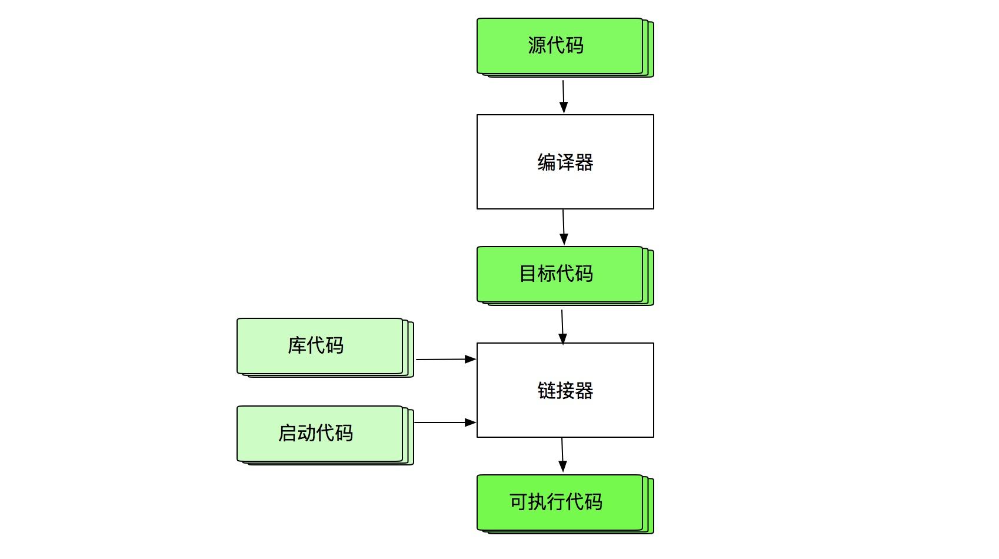

# 1.8 编程机制

## 1.8.1 目标代码文件、可执行文件和库

C编程的基本策略是，用程序把源代码文件转换为可执行文件（其中包含可直接运行的机器语言代码）。
典型的C实现通过`编译`和`链接`两个步骤来完成这一过程。编译器把源代码转换成中间代码，链接器把中间
代码和其他代码合并，生成可执行文件。C使用这种分而治之的方法方便对程序进行模块化，可以独立编译
单独的模块，稍后再用链接器合并已编译的模块。通过这种方式，如果只更改某个模块，不必因此重新
编译其他模块。另外，链接器还将你编写的程序和预编译的库代码合并。

也就是说：
* `源代码`通过编译器生成`目标代码`
* `目标代码`通过链接器链接`库代码`和`启动代码`之后才是`可执行代码`

## 1.8.3 GNU编译器集合和LLVM项目

### GNU编译器
GNU项目始于1987年，是一个开发大量免费UNIX软件的集合（GNU的意思是 GNU's Not Unix）。GNU编译器集合（也被称为GCC，其中包含GCC C编译器）是
该项目的产品之一。GCC在一个指导委员会的带领下，持续不断地开发，它的C编译器紧跟C标准的改动。GCC有各种版本以适应不同的硬件平台和操作系统，包括
UNIX、Linux和Windows。用gcc命令便可调用GCC C编译器。许多使用gcc的系统都用cc作为gcc的别名。

### LLVM项目
LLVM项目成为cc的另一个替代品。该项目是与编译器相关的开源软件集合，始于伊利诺伊大学的2000份研究项目。它的Clang编译器处理C代码，可以通过clang
调用。有多种版本供不同的平台使用，包括Linux。2012年，Clang成为FreeBSD的默认C编译器。Clang也对最新的C标准支持的很好。

## 1.8.5 PC的命令行编译器

C编译器不是标准Windows软件包的一部分，因此需要从别处获取并安装C编译器。有如下两种选择：
* Cygwin
    - Cygwin在自己的视窗运行，模仿Linux命令行环境，有一行命令提示
* MinGW
    - MinGW在Windows的命令提示模式中运行

